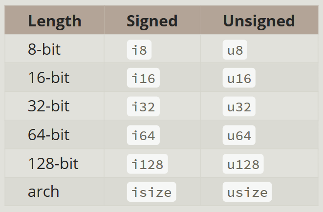
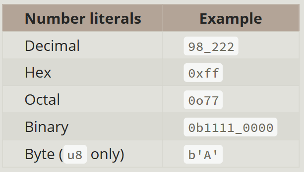

<link rel='stylesheet' href='notes.css'>

# Rust Ch_1-3

## Ch_1

### Let’s recap what we’ve learned so far about Cargo

- We can create a project using cargo new.
- We can build a project using cargo build.
- We can build and run a project in one step using cargo run.
- We can build a project without producing a binary to check for errors using cargo check.
- Instead of saving the result of the build in the same directory as our code, Cargo stores it in the target/debug directory.

---
---

## Ch_3- Common Programming Concepts

### Keywords

- words that are reserved for use by the language only,
- you cannot use these words as names of variables or functions.
- have special meanings, used to do various tasks in your Rust programs.
- a few have no current functionality associated with them but have been reserved for functionality that might be added to Rust in the future.

---

### Variables and Mutability

- By default, variables are immutable
- eg:
  `let x = 5` (Immutable)
- Mutable:
  `let mut x = 5`

#### Constants

- Like immutable variables, constants are values that are bound to a name and are not allowed to change
- you aren’t allowed to use `mut` with constants
  - Constants are always immutable
- keyword: `const`,
- the type of the value must be annotated.
- Constants can be declared in any scope (including global)
- constants may be set only to a constant expression, not the result of a value that could only be computed at runtime.
- Rust’s naming convention for constants is to use all uppercase with underscores between words.
- Constants are valid for the entire time a program runs, within the scope in which they were declared.

#### Shadowing

- declare a new variable with the same name as a previous variable.
- The second variable is what the compiler will see when you use the name of the variable.
- the second variable overshadows the first, taking any uses of the variable name to itself until either it itself is shadowed or the scope ends.
- we’ll get a compile-time error if we accidentally try to reassign to this variable without using the let keyword. By using let, we can perform a few transformations on a value but have the variable be immutable after those transformations have been completed.

---

### Data Types

- Every value in Rust is of a certain data type, which tells Rust what kind of data is being specified so it knows how to work with that data.
- Rust is a statically typed language, it must know the types of all variables at compile time.
- two data type subsets: scalar and compound.

#### Scalar Types

Rust has four primary scalar types:

- integers
- floating-point numbers
- Booleans
- characters

##### Integer Types

Numbers without a fractional component


> n-bit (un or in) =>
>
> unsigned: _0 to ((2^n)-1)_
>
> signed: _(-((2)^(n-1))) to (((2)^(n-1))-1)_
>
> the `isize` and `usize` types depend on the architecture “arch” of the computer your program is running on, 64 or 32 bits.
> you’d use isize or usize when indexing some sort of collection.

- number literals that can be multiple numeric types allow a type suffix, such as 57u8, to designate the type.


###### Integer Overflow

if you try to change the variable to a value outside that range result in either:-

1. When you’re compiling in debug mode, your program will panic at runtime, as Rust includes checks for integer overflow.
2. When you’re compiling in release mode with the --release flag, Rust performs two’s complement wrapping. Rust does not include checks for integer overflow that cause panics.

> Two’s complement wrapping
> : values greater than the maximum value the type can hold “wrap around” to the minimum of the values the type can hold.  

To explicitly handle the possibility of overflow, you can use these families of methods provided by the standard library for primitive numeric types:

- Wrap in all modes with the wrapping_* methods, such as wrapping_add.
- Return the None value if there is overflow with the checked_* methods.
- Return the value and a boolean indicating whether there was overflow with the overflowing_* methods.
- Saturate at the value’s minimum or maximum values with the saturating_* methods.

##### Floating-Point Types

Numbers with decimal points.  
32 bits or 64 bits (default) in size.  
Always signed.

##### Numeric Operations

addition, subtraction, multiplication, division, and remainder.
+, -, *, /, /, %
Integer division truncates toward zero to the nearest integer.

##### The Boolean Type

`: bool`  
`true` and `false`

##### The Character Type

`: char`  
Alphabetic type.  
Size: four bytes.  
Represents a Unicode Scalar Value.
> Unicode Scalar Values range from U+0000 to U+D7FF and U+E000 to U+10FFFF inclusive.

#### Compound Types

Compound types
: group multiple values into one type.

Rust has two primitive compound types:

- tuples `: tup`
- arrays

##### The Tuple Type

General way of grouping together a number of values with a variety of types into one compound type.  

have a fixed length: once declared, they cannot grow or shrink in size.  
comma-separated list of values inside parentheses. `(t1, t2, t3, ..)`  
Each position in the tuple has a type, and the types of the different values in the tuple don’t have to be the same.  

_destructuring_
: using a pattern with let to take tup single tuple into multiple separate variables.  

We can also access a tuple element directly by using a period (.) followed by the index (0, 1..) of the value we want to access.

_unit_
: tuple without any values

- This value and its corresponding type are both written () and represent an empty value or an empty return type. 
- Expressions implicitly return the unit value if they don’t return any other value.

##### The Array Type

A collection of multiple values, every element of it must have the same type.
Arrays in Rust have a fixed length.  
We write the values in an array as a comma-separated list inside square brackets. `[a1, a2, a3, ..]`  

Arrays are useful when:

- you want your data allocated on the stack rather than the heap.
- you want to ensure you always have a fixed number of elements. eg.
  - names of the month in a program.
- write an array’s type using square brackets with the type of each element, a semicolon, and then the number of elements in the array. `arr: [type;no] = [a1, a2, ..];`
- initialize an array to contain the same value for each element by specifying the initial value, followed by a semicolon, and then the length of the array in square brackets. `let a = [3; 5];`

> A vector is a similar collection type provided by the standard library that is allowed to grow or shrink in size.
> If you’re unsure whether to use an array or a vector, chances are you should use a vector.

###### Accessing Array Elements

Array is a single chunk of memory of a known, fixed size that can be allocated on the stack.  
You can access elements of an array using indexing.

- using index arr [0], [1], ..

###### Invalid Array Element Access

if you try to access an element of an array that is past the end of the array, using an invalid value in the indexing operation, the program resulted in a runtime error.
When you attempt to access an element using indexing, Rust will check that the index you’ve specified is less than the array length. If the index is greater than or equal to the length, Rust will panic.  
This check has to happen at runtime.

---

### Functions

`main()` function: entry point of programs.  
`fn` keyword:  to declare new functions.  
snake case is used in rust for variable and function names. letters are lowercase and underscores separate words

We define a function in Rust by entering fn followed by a function name and a set of parentheses. The curly brackets tell the compiler where the function body begins and ends.  

Rust doesn’t care where you define your functions (before or after the main), only that they’re defined somewhere in a scope that can be seen by the caller.

#### Parameters and arguments

Parameters
: Special variables, part of a function’s signature.  

Arguments
: concrete values for those parameters provided to the function when calling it.

usually used interchangeably

The `println!` macro puts Argument where the pair of curly brackets `{}` containing corresponding Parameter was in the format string.

In function signatures, you must declare the type of each parameter(type annotations).

parameter declarations are separated with commas `,`

#### Statements and Expressions

Function bodies are made up of a series of statements optionally ending in an expression.

> ! **Rust is an expression-based language** !

- Statements: instructions that perform some action and do NOT return a value. eg:
  - `let` var assigning
  - `fn` func declaration
- Expressions: evaluate to a resultant value and return it. eg:
  - Calling a function
  - Calling a macro
  - A new scope block created with curly brackets (inside of it)
- Expressions do not include ending semicolons.
- If you add a semicolon to the end of an expression, you turn it into a statement, and it will then not return a value.

#### Functions with Return Values

We don’t name return values, but we must declare their type after an arrow (`->`).

---

### Comments

`//` - single line, till end of it.
`/* */` - multiline.

---

### Control Flow

to run some code:

- depending on whether a condition is `true`
- repeatedly while a condition is `true`

#### if Expressions

branch your code depending on conditions.
> “If this condition is met, run this block of code.  
> If the condition is not met, do not run this block of code.”

keyword `if`

arms: Blocks of code associated with the conditions in if expressions.

else expression: Optional, to give the program an alternative block of code to execute should the condition evaluate to `false`.

The condition in this code must be a `bool`, otherwise we’ll get an error.

> Rust will not automatically try to convert non-Boolean types to a Boolean i.e. (0 is False and any int > 0 True) is not applied, int and bool remain separate and non interchangeable.  
> You must be explicit.

##### Handling Multiple Conditions with else if

use multiple conditions by combining if and else in an else if expression.

it checks each if expression in turn and executes (only) the first body for which the condition evaluates to true.  
it doesn’t check the rest.

##### Using if in a let Statement

We can use it on the right side of a let statement to assign the outcome based on the outcome of the if expression to a variable.

the values that have the potential to be results from each arm of the if must be the same type,  
variables must have a single type and Rust needs to know at compile time.

#### Repetition with Loops

to execute a block of code more than once, run through the code inside the loop body to the end and then start immediately back at the beginning.

Rust has three kinds of loops:

1. loop
2. while
3. for

##### Repeating Code with loop

`loop` keyword, tells Rust to execute a block of code over and over again forever or until you explicitly tell it to stop.

`break` keyword, within the loop to tell the program when to stop executing the loop.

`continue` keyword, which in a loop tells the program to skip over any remaining code in this iteration of the loop and go to the next iteration.

`return` keyword, exits the current function.

###### Loop Labels to Disambiguate Between Multiple Loops

If you have loops within loops, `break` and `continue` only apply to the innermost loop at that point.  
loop label on a loop can be optionally be specified to have these keywords apply to the labeled loop rather than the innermost loop.  
they begin with a single quote. `'` 

``` Rust
'<label_name>: loop {
  loop {  
    break/continue; // applies only to inner loop  
    break/continue '<label_name>; // apply to labeled loop  
  }
}
```

##### Conditional Loops with while

to evaluate a condition `within` a loop,  
While the condition is `true`, the loop runs. When `false`, the program calls `break`, stopping the loop.

``` Rust
loop {
  if <condition> {
    <statements>;
  } else {
    break;
  }
}

while <condition> {
  <statements>;
}
```

##### Looping Through a Collection with for

> the while construct can be used to loop over the elements of a collection, such as an array.  
> But this approach is error prone;

We use the for loop there:

``` Rust
<c_var> = <compound DT def>;
for <s_var> in <c_var> {
  <statements>;
}
```

The safety and conciseness of for loops make them the most commonly used loop construct in Rust.  

To run some code a certain number of times, instead of `while`, `for` loop can be used using Range,  
Range- `m..n`
: provided by the standard library, which generates all numbers in sequence starting from one number (m) and ending before another number (n).  
`(m..n).rev()` can be used to reverse a list.

---

### Summary

1. variables,
2. scalar and compound data types,
3. functions,
4. comments,
5. if expressions,
6. loops!

---
---

## Ch_2- Programming a Guessing Game

``` Rust

```

hands-on project - introduction to a few common Rust concepts by showing how to use them in a real program.

let, match, methods, associated functions, external crates, and more!

**Guessing Game**  
The program will generate a random integer between 1 and 100. It will then prompt the player to enter a guess.  
After a guess is entered, the program will indicate whether the guess is too low or too high.  
If the guess is correct, the game will print a congratulatory message and exit.

### Processing a Guess, io

_prelude_: set of items defined in the standard library `std`, which Rust brings into the scope of every program, by default.  
`use` statement explicitly brings a type into scope, that you want to use but isn’t in the prelude.

The `io` input/output library is used to obtain user input and then print the result as output.  
io although comes from the standard library, is not part of prelude.

`::` indicates, scope resolution or association.

#### Storing Values with Variables

``` Rust
  let mut guess = String::new();
```

`let` statement to create a variable,  
`mut` before the name to make it mutable,  
equal sign (`=`) to bind right side to it,  
calling String::new function to returns a new instance of a String, that is a growable, UTF-8 encoded bit of text

#### Receiving User Input

``` Rust
  io::stdin()
    .read_line(&mut guess)
```

call the `stdin` function from the io module, to handle user input. It returns an instance of `std::io::Stdin`, a type that represents a handle to the standard input for your terminal.
> If we hadn’t imported the io library with use `std::io;` at the beginning of the program, we could still use the function by writing this function call as `std::io::stdin`.  
`.read_line(&mut guess)` calls the `read_line` method on the standard input handle to get input from the user,  
passing &mut guess as the argument to read_line to tell it what string to store the user input in,  
i.e. it takes whatever the user types into standard input and append that into a string, passed as an argument (without overwriting its contents).  
> The string argument needs to be mutable so the method can change the string’s content.

`&` reference indication to argument, gives you a way to let multiple parts of your code access one piece of data without needing to copy that into memory multiple times.
> references are immutable by default, you need to write `&mut <v_name>` rather than `&<v_name>` to make it mutable.

#### Handling Potential Failure with Result

``` Rust
    .expect("Failed to read line");
```

it’s still part of a single logical line of code, till `;` or `{}` or some other termination comes,  
one long line is difficult to read, so it’s best to divide it.

`read_line` also returns a `Result` value, an enumeration `enum`, a type that can be in one of multiple possible states, called `variant`.

- these `Result` types encode error-handling information.  
- Result’s variants are `Ok` and `Err`.
  - Ok indicates the operation was successful, and has successfully generated value inside.
  - Err variant means the operation failed, and contains information about how or why the operation failed.

expect method on a instance of Result will, in case of-

- `Err`, cause the program to crash and display the message you passed as argument
  - error comes from the underlying operating system
- `Ok`, take and return just the return value that Ok is holding, so you can use it,
  - here- number of bytes in the user’s input.

#### Printing Values with println! Placeholders

``` Rust
  println!("You guessed: {}", guess);
```

`println()` is a function and `println!()` a macro.  

`""` encloses strings.  

`{}` (set of curly brackets) is a placeholder, when printing- 

- The value of a variable, the variable name can go inside the curly brackets.  
- The result of evaluating an expression, place empty `{}` in the format string, then follow it with a comma-separated list of expressions to print in each empty `{}` in the same order.  

### Generating a Secret Number

random number between 1 and 100,
Rust doesn’t have random number functionality in standard library, but a `rand` crate.

#### Using a Crate to Get More Functionality

crate: collection of Rust source code files.  

- Project we’ve been building is a binary crate, which is an executable.
- The rand crate is a library crate, which contains code that is intended to be used in other programs and can’t be executed on its own.

to write code that uses `rand`, we need to modify the Cargo.toml file to include the it as a dependency, by adding the following line to the bottom, beneath the [dependencies] section header in Cargo.toml file.  
In [dependencies] you tell Cargo which external crates your project depends on and which versions of those crates you require.  
cargo understands Semantic Versioning (SemVer), a standard for writing version numbers, the specifier 0.8.5 is actually shorthand for ^0.8.5, which means any version that is at least 0.8.5 but below 0.9.0.  
Cargo considers these versions to have public APIs compatible with version specified.  

without changing any of the code, we build the project using- `cargo build`.
When we include an external dependency, Cargo fetches the latest versions of everything that dependency needs from the registry, which is a copy of data from Crates.io. Crates.io is where people in the Rust ecosystem post their open source Rust projects for others to use.  
After updating the registry, Cargo checks the [dependencies] section and downloads any crates listed or are needed/ depended by for those, that aren’t already downloaded.  
After downloading the crates, Rust compiles them and then compiles the project with the dependencies available.
Cargo is efficient and will only make changes required, if you haven’t changed anything about them in your Cargo.toml file or haven’t changed anything about your code, then only finished line or only project build again.  

##### Ensuring Reproducible Builds with the Cargo.lock File

Cargo has a mechanism that ensures you can rebuild the same artifact every time you or anyone else builds your code: Cargo will use only the versions of the dependencies you specified until you explicitly indicate otherwise.  
Cargo.lock file is important for reproducible builds, it’s often checked into source control with the rest of the code in your project.

#### Updating a Crate to Get a New Version

When you do want to update a crate, Cargo provides the command update, which will ignore the Cargo.lock file and figure out all the latest versions that fit your specifications in Cargo.toml.  
Cargo will then write those versions to the Cargo.lock file. In this case, Cargo will only look for versions >0.8.5 and <0.9.0.
To use rand version 0.9.0 or any version in the 0.9.x series, you’d have to update the Cargo.toml file manually in SemVer.

### Generating a Random Number

``` Rust
  let secret_number = rand::thread_rng().gen_range(1..=100);
```

using rand to generate a number to guess.  
`use rand::Rng;`  
The `Rng` trait defines methods that random number generators implement, and this trait must be in scope for us to use those methods.

We call the,
`rand::thread_rng` function that gives us the particular random number generator we’re going to use: local to the current thread of execution and seeded by the operating system.  
`gen_range` method on the random number generator, defined by the `Rng` trait. It takes a range expression as an argument and generates a random number in the range.
range expression - `start..=end` (inclusive on the lower and upper bounds)

> running the `cargo doc --open` command will build documentation provided by all your dependencies locally and open it in your browser.

we also  prints the secret number, useful while we’re developing the program to be able to test it, but we’ll delete it from the final version obviously.

### Comparing the Guess to the Secret Number

``` Rust
  use std::cmp::Ordering;

  match guess.cmp(&secret_number) {
    Ordering::Less => println!("Too small!"),
    Ordering::Greater => println!("Too big!"),
    Ordering::Equal => println!("You win!"),
```

add another `use` statement, bringing a type called `std::cmp::Ordering` into scope from the standard library.  
another `enum` with three variants- `Less`, `Greater`, and `Equal`, outcomes that are possible when you compare two values.  
The `cmp` method compares two values and can be called on anything that can be compared, returns a variant of the Ordering enum.  
`match` expression, made up of arms consisting of a pattern to match against, decides what to do next i.e.
the code that should be run if the value given to match fits that arm’s pattern,  
based on which variant of Ordering was returned from the call to cmp with the values in guess and secret_number.  
The match expression ends after the first successful match, so it won’t look at the last arm in this scenario.

Rust has a strong, static type system. However, it also has type inference.  
Rust cannot compare a string and a number type.

``` Rust
let guess: u32 = guess.trim().parse().expect("Please type a number!");
```

shadow the previous value of guess, reusing the guess variable name, rather than creating two unique variables  
We bind this new variable to the expression `guess.trim().parse()`,
`guess` in this expression is the original `guess` variable, containing the input as a `string`.  
The `trim` method on a `String` instance will eliminate any whitespace at the beginning and end and it eliminates \n or \r\n added when user presses `enter` to satisfy `read_line` and input their `guess`  
The parse method on strings converts a string to another type. It only work on characters that can logically be converted into numbers, and returns a Result type.  
The colon (:) after guess tells Rust we’ll annotate the variable’s type.

### Allowing Multiple Guesses with Looping

The loop keyword creates an infinite loop but It doesn’t seem like the user can quit!  

- using the keyboard shortcut `ctrl-c`
- entering any other non-number input.

we want the game to also stop when the correct number is guessed.

### Quitting After a Correct Guess

quit when the user wins by adding a break statement.

### Handling Invalid Input

Rather than crashing the program on an error i.e. when the user inputs a non-number, we will handling the error i.e. to make the game ignore a non-number so the user can continue guessing,  
Using an expect call to a match expression.  

- If parse is able to successfully turn the string into a number, returning an Ok value containing the resultant number. That Ok value will match the first arm’s pattern, and the match expression will just return the num value that parse produced and put inside the Ok value. That number will end up right where we want it in the new guess variable we’re creating.
- If parse is not able to turn the string into a number, it will return an Err value that contains more information about the error. The Err value does not match the Ok(num) pattern in the first match arm, but it does match the Err(\_) pattern in the second arm. In this example, we want to match all Err values, no matter what information they have inside them. So the program will execute the second arm’s code, continue, which tells the program to go to the next iteration of the loop and ask for another guess. So, effectively, the program ignores all errors that parse might encounter!  

> The underscore, \_, is a catchall value that we want to match with all values, no matter what information they have inside them.

Delete the println! that outputs the secret number.

### Summary

This project was a hands-on way to introduce you to many new Rust concepts: let, match, functions, the use of external crates, and more.

``` Rust
use rand::Rng;
use std::cmp::Ordering;
use std::io;

fn main() {
    println!("Guess the number!");

    let secret_number = rand::thread_rng().gen_range(1..=100);

    loop {
        println!("Please input your guess.");

        let mut guess = String::new();

        io::stdin()
            .read_line(&mut guess)
            .expect("Failed to read line");

        let guess: u32 = match guess.trim().parse() {
            Ok(num) => num,
            Err(_) => continue,
        };

        println!("You guessed: {guess}");

        match guess.cmp(&secret_number) {
            Ordering::Less => println!("Too small!"),
            Ordering::Greater => println!("Too big!"),
            Ordering::Equal => {
                println!("You win!");
                break;
            }
        }
    }
}
```
